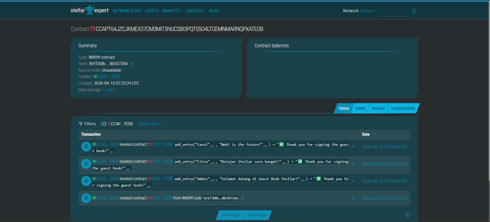

# Stellar Guest Book DApp

**Stellar Guest Book DApp** - Blockchain-Based Decentralized Guest Book System

## Project Description

Stellar Guest Book DApp is a decentralized smart contract solution built on the Stellar blockchain using Soroban SDK. It provides a secure, immutable platform for visitors to leave their name and messages directly on the blockchain. The contract ensures that all guest entries are stored transparently and are only manageable through predefined smart contract functions, eliminating reliance on centralized database providers.

The system allows users to add, view, and delete guest entries, leveraging the efficiency and security of the Stellar network. Each entry is stored with a name, message, and automatic timestamp, ensuring data persistence and reliability.

## Project Vision

Our vision is to revolutionize digital guest books and user feedback systems by:

- **Decentralizing Data**: Moving guest book entries from centralized servers to a global, distributed blockchain
- **Ensuring Authenticity**: Providing a permanent, tamper-proof record of guest messages
- **Guaranteeing Immutability**: Creating an unalterable history of all guest interactions
- **Building Trustless Systems**: Creating a platform where data integrity is guaranteed by code, not by company promises

We envision a future where digital interactions are truly transparent and verifiable, empowering individuals and businesses with complete autonomy over their data.

## Key Features

### 1. **Simple Entry Creation**

- Add guest entries with just one function call
- Specify name and message for each entry
- Automatic timestamp recording
- Persistent storage on the Stellar blockchain

### 2. **Efficient Data Retrieval**

- Fetch all stored entries in a single call
- Structured data representation for easy frontend integration
- Quick access to your entire guest book collection
- Real-time synchronization with the blockchain state

### 3. **Secure Deletion**

- Remove specific entries using their index position
- Permanent removal from the contract storage
- Clean and efficient storage management
- Immediate update of the entry list after deletion

### 4. **Clear All Functionality**

- Remove all entries at once with a single function
- Reset the guest book to empty state
- Useful for event-based guest books

### 5. **Stellar Network Integration**

- Leverages the high speed and low cost of Stellar
- Built using the modern Soroban Smart Contract SDK
- Scalable architecture for growing entry collections
- Interoperable with other Stellar-based services

## Contract Details

| Property | Value |
|----------|-------|
| Network | Stellar Testnet |
| Contract ID | `CCAPT64JZCJKMEX37OM3MIT5NUCSBI3PQTS5O4LTGEMNMARNQPXATEDB` |
| Explorer | [View on Stellar Expert](https://stellar.expert/explorer/testnet/contract/CCAPT64JZCJKMEX37OM3MIT5NUCSBI3PQTS5O4LTGEMNMARNQPXATEDB) |



## Smart Contract Functions

### `add_entry(name: String, message: String) -> String`
Adds a new entry to the guest book with the visitor's name and message. Timestamp is automatically recorded.

### `get_entries() -> Vec<GuestEntry>`
Returns all entries stored in the guest book, including name, message, and timestamp.

### `delete_entry(index: u32) -> String`
Deletes a specific entry by its index position (0 = first entry).

### `clear_all_entries() -> String`
Removes all entries from the guest book (resets to empty).

## Usage Examples

### Add a new entry
```bash
stellar contract invoke \
  --id CCAPT64JZCJKMEX37OM3MIT5NUCSBI3PQTS5O4LTGEMNMARNQPXATEDB \
  --source sabil \
  --network testnet \
  -- add_entry \
  --name "Carol" \
  --message "Amazing guest book system!"

View all entries
bash
stellar contract invoke \
  --id CCAPT64JZCJKMEX37OM3MIT5NUCSBI3PQTS5O4LTGEMNMARNQPXATEDB \
  --source sabil \
  --network testnet \
  -- get_entries

Delete an entry (e.g., first entry)
bash
stellar contract invoke \
  --id CCAPT64JZCJKMEX37OM3MIT5NUCSBI3PQTS5O4LTGEMNMARNQPXATEDB \
  --source sabil \
  --network testnet \
  -- delete_entry \
  --index 0

Clear all entries
bash
stellar contract invoke \
  --id CCAPT64JZCJKMEX37OM3MIT5NUCSBI3PQTS5O4LTGEMNMARNQPXATEDB \
  --source sabil \
  --network testnet \
  -- clear_all_entries
  
Future Scope

Short-Term Enhancements
1. Frontend Web Application: User-friendly interface for interacting with the guest book
2. Entry Rating System: Allow visitors to rate or like entries
3. Rich Media Support: Support for images and emojis in messages
4. Search Functionality: Implement search filters for large entry collections

Medium-Term Development
1. Moderation Features: Implement admin functions to manage inappropriate content
2. Notification System: Off-chain bridge to alert admins of new entries
3. Export Functionality: Allow exporting guest book data to CSV or JSON
4.QR Code Generation: Generate QR codes for easy guest book access

Long-Term Vision
1. Multi-Event Support: Separate guest books for different events
2. Decentralized UI Hosting: Host the frontend on IPFS
3. Analytics Dashboard: Visual insights about guest interactions
4. Cross-Chain Support: Extend to multiple blockchain networks

Technical Requirements
- Soroban SDK 20.0.0
- Rust programming language
- Stellar blockchain network (Testnet)

Getting Started
Deploy the smart contract to Stellar's Soroban network and interact with it using the four main functions:
- add_entry() - Add a new entry with name and message
- get_entries() - Retrieve all stored entries from the contract
- delete_entry() - Remove a specific entry by its index
- clear_all_entries() - Remove all entries at once
